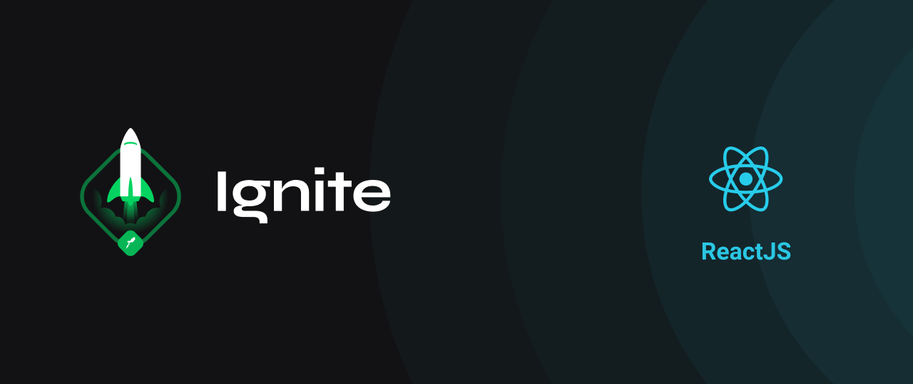

<h1 align="center">   </h1>

<h1 align="center">  👩‍🚀 Spacetraveling </h1>

<p align="center">
   
    
  
  
  
  
</p>

<br>

# 👩‍💻About
<p align="justify">Spacetraveling is a blog about technology! In this challenge, the main goal is to build a blog application from scratch according to <a href="https://www.figma.com/file/ngsimuDBUVT2yY1uG0ptCw/Desafios-M%C3%B3dulo-3-ReactJS-(Copy)/" target="_blank" >Figma layout </a> and implementing the principles we've learned about  ReactJS, Prismic CMS and nextJS so far.</p>

# :art: Layout

<div align="center">
  <p align="center">
    
  </p>

</div>

# :rocket: Tecnologies
- [ReactJS](https://reactjs.org/)
- [NextJS](https://nextjs.org/)
- [TypeScript](https://www.typescriptlang.org/)
- [Date-fns](https://date-fns.org/)
- [Prismic](https://prismic.io/docs)
- [React Icons](https://react-icons.github.io/react-icons/)
- [SASS](https://sass-lang.com/)
- [Utterances](https://utteranc.es/)

# 🔧 Run Locally

Clone the project

```bash
  git clone git@github.com:Joseane-Guedes/Ignite-Reactjs-challenge5.git
```

Go to the project directory

```bash
  cd Ignite-Reactjs-challenge5
```

Install dependencies

```bash
  yarn
```

Start the server

```bash
  yarn dev
```
# :closed_book: License

Released in 2021 :closed_book: License

This project is under the [MIT license](./LICENSE).

#

<!-- <p align="center">
   <b> &#60;/&#62; by <a href="https://www.linkedin.com/in/joseane-guedes/">Joseane Guedes</a></b>
</p> -->

Made with :purple_heart: by [Rocketseat](https://rocketseat.com.br/ignite) :rocket: and [Joseane Guedes ](https://github.com/Joseane-Guedes) :woman_technologist:


